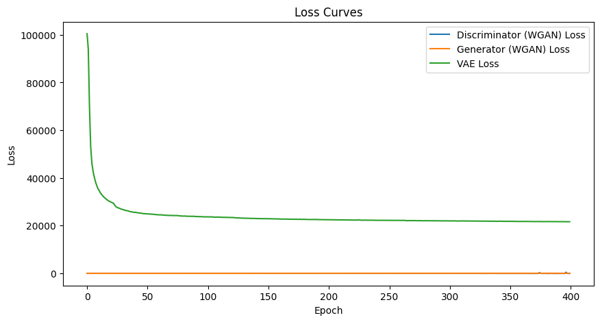
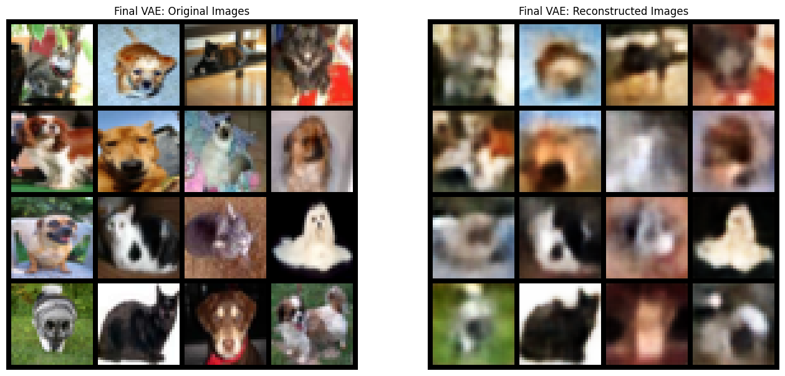
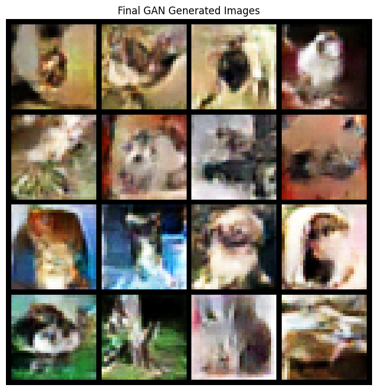

# VAE & GAN on CIFAR-10 Dataset

This notebook demonstrates the training and comparison of two generative models — a **Variational Autoencoder (VAE)** and a **Wasserstein GAN with Gradient Penalty (WGAN-GP)** — on the [CIFAR-10 PNGs in Folders dataset](https://www.kaggle.com/datasets/swaroopkml/cifar10-pngs-in-folders).

Both models are trained to learn and generate 32×32 RGB images across 2 classes  cat and dog.

---

## 📦 Dataset

- **Name:** CIFAR-10 PNGs in Folders
- **Source:** [Kaggle - swaroopkml](https://www.kaggle.com/datasets/swaroopkml/cifar10-pngs-in-folders)
- **Structure:**
cifar10/train/
├── ...
├── cat/
├── ...
├── dog/
└── ...


---

## 🧠 Models Implemented

### 🔹 1. Variational Autoencoder (VAE)
- **Encoder:** 3-layer CNN encodes image into latent distribution (mean and log variance).
- **Decoder:** 3-layer deconv net reconstructs image from latent code.
- **Loss:** Reconstruction Loss + KL Divergence.

### 🔹 2. WGAN-GP (Wasserstein GAN with Gradient Penalty)
- **Generator:** Upsampling from 128-D noise vector to 32×32 RGB.
- **Discriminator (Critic):** CNN with spectral normalization.
- **Loss:** Wasserstein Loss + Gradient Penalty.

---

## 📊 Visualizations

### ✅ Training Loss Curve
Track of critic and generator losses over epochs:
Combined reconstruction and KL loss across epochs:




---

### 🖼️ Final VAE Output (Reconstructions)

Comparison of original CIFAR-10 images with VAE reconstructions:



---

### 🖼️ Final GAN Output (Generated Samples)

Randomly generated CIFAR-10-like samples using WGAN-GP:



---

## 🛠 Training Configuration

| Parameter        | Value        |
|------------------|--------------|
| Epochs           | 400          |
| Batch Size       | 128          |
| Image Size       | 32x32        |
| Latent Dim (GAN) | 128          |
| Latent Dim (VAE) | 100          |
| Optimizer        | Adam         |
| Dataset Format   | RGB (3 channels) |

---

## 🚀 How to Run

1. Download and extract [this dataset](https://www.kaggle.com/datasets/swaroopkml/cifar10-pngs-in-folders).
2. Clone this repo or run the notebook in your environment.
3. Make sure PyTorch, torchvision, matplotlib, and progressbar2 are installed.
4. Execute all cells in sequence for full training.

---

## 📦 Requirements

```bash

pip install torch torchvision matplotlib progressbar2

```

## 📌 Notes
GAN may produce better sample quality but requires careful training.

VAE tends to blur outputs but has strong latent representation learning.

You can adjust the latent dimensions and loss coefficients to tune performance.

